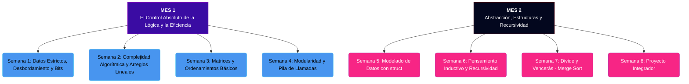

# 🧠 Low-Level Logic: Reinicio de Fundamentos y Pensamiento Algorítmico

> **¡Bienvenido/a al gimnasio mental de la lógica de bajo nivel!** Este repositorio es un espacio de entrenamiento autónomo, intensivo y de código abierto diseñado para **romper los vicios de la academia tradicional y aprender a programar de verdad**, entendiendo el impacto real de cada línea de código en la memoria y la CPU.

---

## ⚡ Filosofía del Entrenamiento

* 🚫 **Sin Ruedas de Entrenamiento:** Está estrictamente prohibido el uso de librerías avanzadas o métodos de alto nivel (como `std::sort`, vectores dinámicos automáticos, etc.). Todo se construye desde los fundamentos físicos (bucles, punteros, operaciones de bits y aritmética de direcciones a mano).
* 🔄 **Git desde el Primer Segundo:** No subimos archivos sueltos. Cada reto se resuelve en una rama independiente y se integra mediante un flujo real de *Pull Requests*.
* 📏 **Criterio de Eficiencia (Big O):** No basta con que el código "corra". Evaluamos y justificamos la complejidad temporal y espacial en Notación Big O.
* 🧪 **Automatización Profesional:** Cada día de retos cuenta con un script de prueba en Python (`test_dia_N.py`) que compila tu código con `g++ -O2` y valida la solución localmente con múltiples casos extremos de prueba antes de enviar tu PR.

---

## 🗺️ Mapa de Ruta (Roadmap de 2 Meses)



---

## 📅 Estructura de Trabajo Diaria

Para evitar la sobrecarga de información y asegurar un aprendizaje progresivo, cada semana se organiza en **7 días independientes** con **5 retos de código por día** (35 retos semanales en total):

```text
📂 mes-1-logica/
 └── 📂 semana-1-variables/
      ├── 📄 README.md  (Introducción de la semana)
      ├── 📂 dia-1/
      │    ├── 📄 README.md  (Teoría y Retos del Día 1)
      │    ├── 📄 test_dia_1.py  (Validador automático)
      │    ├── 📂 plantillas/  (Retos 1 al 5 vacíos)
      │    └── 📂 soluciones/  (Tus soluciones resueltas)
      ├── 📂 dia-2/ ...
```

---

## 🛠️ Flujo de Trabajo Profesional (Paso a Paso)

Para resolver los retos, sigue estrictamente este flujo de Git y Consola:

### 1. Preparar tu Entorno local
Clona el repositorio y crea una rama independiente para trabajar en los retos de la semana actual:
```bash
git clone https://github.com/TU_USUARIO/low-level-logic.git
cd low-level-logic
git checkout -b solucion/semana-X-tu-nombre
```

### 2. Seleccionar y Resolver un Reto
1. Ve al directorio del día en el que estás trabajando (por ejemplo, Semana 1, Día 1):
   ```bash
   cd mes-1-logica/semana-1-variables/dia-1/
   ```
2. Copia la plantilla del reto a la carpeta `soluciones/` para no modificar la plantilla original:
   ```bash
   cp plantillas/reto_1.cpp soluciones/reto_1.cpp
   ```
3. Abre `soluciones/reto_1.cpp` en tu editor de código y completa la lógica correspondiente dentro de la sección indicada.

### 3. Validar con Pruebas Automatizadas
Ejecuta el script validador en Python pasando la ruta del archivo que modificaste:
```bash
python3 test_dia_1.py soluciones/reto_1.cpp
```
Si tu código es correcto y maneja todos los casos límite, verás un mensaje de éxito. También puedes probar todo lo que lleves resuelto en el día con:
```bash
python3 test_dia_1.py all
```

> [!IMPORTANT]
> Los scripts de prueba validan casos extremos (valores máximos, mínimos, arreglos vacíos o desordenados) para asegurar que el código sea verdaderamente robusto y no solo compile.

### 4. Enviar tu Solución
Una vez completes los retos de la semana, sube tus cambios y abre un Pull Request:
```bash
git add .
git commit -m "feat(semana-X): resolver retos del día 1 al 7"
git push origin solucion/semana-X-tu-nombre
```
Luego, ve a GitHub y abre el Pull Request (PR) hacia la rama `main` explicando tu solución y justificando las complejidades Big O cuando se requiera.

---

> [!TIP]
> **Aprender duele un poco:** Si una prueba falla, lee detalladamente la salida del script `test_dia_N.py`. Te dirá exactamente qué entrada causó el fallo y qué valor devolvió tu programa frente al valor esperado. ¡Usa esto para rastrear y depurar tu lógica!
